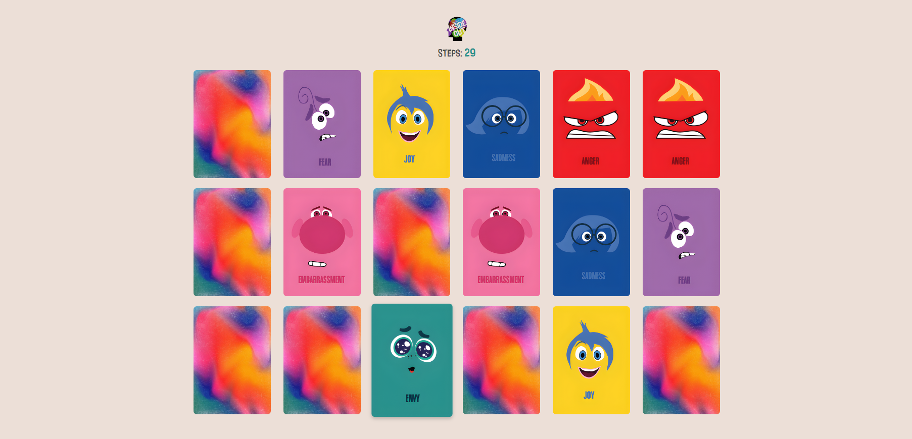

# Memory Game

### About:

This project presents a Memory card game featuring characters from "Inside Out 2." Players flip cards to find matching pairs, aiming to uncover all pairs with the fewest moves possible. With a total of 10 unique characters from the film, players must rely on their memory skills to adapt and recall the positions of previously revealed cards. The objective is to match all character pairs efficiently and strategically.

### Demo:

### Technologies Used:

### Packages Used:

-   [React Grid System](https://www.npmjs.com/package/react-grid-system)

### Other Links:

-   [Cards of emotions](https://freepitmk.shop/product_details/1859080.html)
-   [Font InsideOut](https://www.fontspace.com/category/inside-out)
